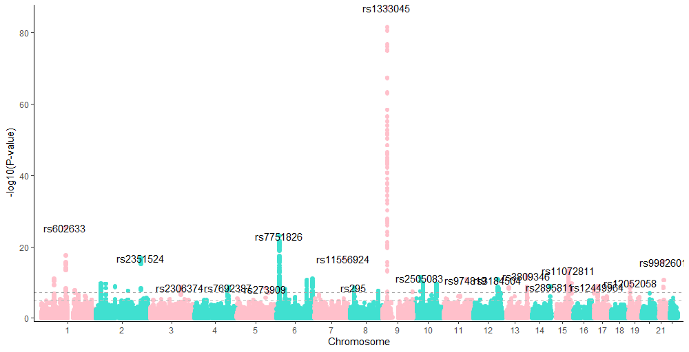

# Introduction

This is a very fast and easy-to-individualize plotting function for GWAS results e.g. pvalues. Since I'm using ggplot2 a lot, I forked a very nice [project](https://github.com/boxiangliu/manhattan) from boxiangliu and combined it with a super fast plotting approach from the [scattermore project](https://github.com/exaexa/scattermore).  

A manhattan plot displays pvalues chromosomal positions against -mostly -log10 values- of genome-wide association studies between single nucleotide variants (SNV) or polymorphisms (SNP) and an endpoint e.g. expression, enzyme activity or case-control data. 

One of the first R packages offering manhatten as well as qq plots was [qqman](https://github.com/stephenturner/qqman) from [Stephen Turner](https://twitter.com/strnr), and nowadays there are a lot of different packages and approaches available for R and python. But a very fast one, which is still fast when plotting billions of data points, is still missing. 

This package `FASTGWASMAN` is trying to fill this gap. 


# Installation

So far the package is tested on Windows and MacOS, but is not on Cran, thus you need to: 


    devtools::install_github("roman-tremmel/FASTGWASMAN")
 
The package is depending on the additional packages `ggplot2` and `scattermore`. So far, the latter one has to be installed using:

    devtools::install_github('exaexa/scattermore', dependencies = F, force = T)
    
# Usage

## The normal one

As an example you can load some data which is included in the package and run following code. More information of the data set is provided [here](https://github.com/boxiangliu/manhattan).

```{r,cache=TRUE}
data(cad_gwas)
cad_gwas$y <- -log10(cad_gwas$pval)
head(cad_gwas)
```

Important is that the data has the three columns which are required: 

1. `chrom`
2. `pos`
3. `y`

while the `chrom` has to be the format `c("chr1", "chr2", "chr3", ...)`, the `pos` column must be a numeric vector reflecting base pair positions and the `y` column contains the pvalues. Here we `-log10`-transform the pvalues. 


We can plot the manhatten figure similar to the original `manhatten` function, but we have to specify the speed option with the "slow" parameter. 

```{r}
FASTGWASMAN::manhattan(cad_gwas, build='hg18', speed = "slow")
```

## The fast way

Depending on your system this takes a while, particularly when plotting pvalues of more than 1,000,000 SNVs. Therefore, we replace the `geom_point()` function with the `scattermore::geom_scattermore()` function and calling the manhatten function using the `"fast"` option. 

```{r}
FASTGWASMAN::manhattan(cad_gwas, build='hg18', speed = "fast")
```
Zooooom, that was fast, right? How does it work? For the explanation I want to refer to the `scattermore` package. Only so much, the speed is reached with some C code, rasterization and some magic.

Of course you can increase the point size and the resolution by loosing some of the speed. 

```{r}
FASTGWASMAN::manhattan(cad_gwas, build='hg18', speed = "fast", pointsize = 3, pixels = c(1000, 1000))
```


## The insane way

The fastest option is `speed = "ultrafast"`. The fastest way costs that the data is plotted only in pure black. But I think it is it worth. 

```{r}
# some big data file with >10^6 rows
big_cad_gwas <-  do.call(rbind, replicate(15, cad_gwas, simplify = FALSE)) 
FASTGWASMAN::manhattan(big_cad_gwas, build='hg18', speed = "ultrafast")

# compare with
FASTGWASMAN::manhattan(big_cad_gwas, build='hg18', speed = "fast")

# not compare with, unless you want to wait some minutes
FASTGWASMAN::manhattan(big_cad_gwas, build='hg18', speed = "slow")

```

## Individualization 

Of course you can individualize the plot using standard ggplot2 functions.

- other scales

```{r}
FASTGWASMAN::manhattan(cad_gwas, build='hg18', speed = "fast", y_scale = F) +
  ylim(2, 10)
```

Of note, set `y_scale = F` to avoid the error of a present second y-scale.


- add significance line(s)

```{r}
library(tidyverse)
FASTGWASMAN::manhattan(cad_gwas, build='hg18', speed = "fast", color1 = "pink", color2 = "turquoise", pointsize = 3, pixels = c(1000, 500)) +
  geom_hline(yintercept = -log10(5e-08), linetype =2, color ="darkgrey") + # genomewide significance line
  geom_hline(yintercept = -log10(1e-5), linetype =2, color ="grey")  + # suggestive significance line
  geom_text(data = . %>% group_by(chrom) %>% 
                             top_n(1, y) %>% # extract highest y values
                                slice(1) %>% # if there are ties, choose the first one
               filter(y>= -log10(5e-08)), # filter for significant ones 
            aes(label=rsid), color =1) # add top rsid
```


# Questions and Bugs
This R package is still beta. I will work on it as soon I find some time. Please be patient and please report bugs by open github issue(s) [here](https://github.com/roman-tremmel/FASTGWASMAN/issues). 

## To do

- qq-plots
- improved manuals
- improved and cleaner code


