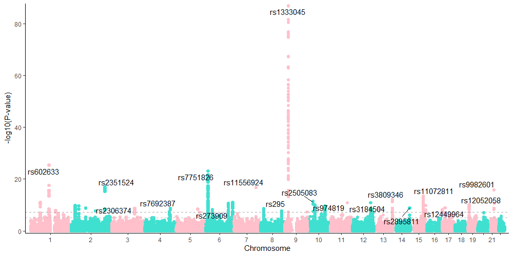

# Introduction

This is a very fast and easy-to-individualize plotting function for GWAS results e.g. pvalues. Since I'm using ggplot2 a lot, I adopted the idea from a very nice [project](https://github.com/boxiangliu/manhattan) from boxiangliu and combined it with a super fast plotting approach from the [scattermore project](https://github.com/exaexa/scattermore).  

A manhattan plot displays pvalues chromosomal positions against -mostly -log10 values- of genome-wide association studies between single nucleotide variants (SNV) or polymorphisms (SNP) and an endpoint e.g. expression, enzyme activity or case-control data. 

One of the first R packages offering manhattan as well as qq plots was [qqman](https://github.com/stephenturner/qqman) from [Stephen Turner](https://twitter.com/strnr), and nowadays there are a lot of different packages and approaches available for R and python. But a very fast one, which is still fast when plotting billions of data points, is still missing. 

This package `FASTGWASMAN` is trying to fill this gap. 


# Installation

So far the package is tested on Windows and MacOS, but is not on Cran, thus you need to: 


    devtools::install_github("roman-tremmel/FASTGWASMAN", upgrade = "never")
 
The package is depending on the additional packages `ggplot2` and `scattermore`. So far, the latter one has to be installed using:

    devtools::install_github('exaexa/scattermore', dependencies = F, force = T, upgrade = "never")
    
# Usage

## The normal one

As an example you can load some data which is included in the package and run following code. More information of the data set is provided [here](https://github.com/boxiangliu/manhattan).

```{r}
library(FASTGWASMAN)
data("gwas_data")
head(gwas_data)
```

Important is that the data has the three columns which are required: 

1. `chr`
2. `pos`
3. `pvalue`

while the `chr` should be the format `c("chr1", "chr2", "chr3", "chrX"...)` but numeric values e.g. `1:22` are also ok, the `pos` column must be a numeric vector reflecting base pair positions and the `pvalue` column contains the pvalues. 


We can plot the manhattan figure similar to the original `manhattan` function, but we have to specify the speed option with the "slow" parameter. 

```{r}
FASTGWASMAN::fast_manhattan(gwas_data, build='hg18', speed = "slow")
```

## The fast way

Depending on your system this takes a while, particularly when plotting pvalues of more than 1,000,000 SNVs. Therefore, we replace the `geom_point()` function with the `scattermore::geom_scattermore()` function and calling the manhattan function using the `"fast"` option. 

```{r}
FASTGWASMAN::fast_manhattan(gwas_data, build='hg18', speed = "fast")
#or
FASTGWASMAN::fast_manhattan(gwas_data, build='hg18', speed = "f")
```
Zooooom, that was fast, right? How does it work? For the explanation I want to refer to the `scattermore` package. Only so much, the speed is reached with some C code, rasterization and some magic.

Of course you can increase the point size and the resolution by loosing some of the speed. 

```{r}
FASTGWASMAN::fast_manhattan(gwas_data, build='hg18', speed = "fast", pointsize = 3, pixels = c(1000, 1000))
```


## The insane way

The fastest option is `speed = "ultrafast"`. The fastest way costs that the data is plotted only in pure black. But I think it is it worth. 

```{r}
# some big data file with >10^6 rows
big_gwas_data <-  do.call(rbind, replicate(15, gwas_data, simplify = FALSE)) 
FASTGWASMAN::fast_manhattan(big_gwas_data, build='hg18', speed = "ultrafast")

# compare with
FASTGWASMAN::fast_manhattan(big_gwas_data, build='hg18', speed = "fast")

# not compare with, unless you want to wait some minutes
FASTGWASMAN::fast_manhattan(big_gwas_data, build='hg18', speed = "slow")

```

## Individualization 

Of course you can individualize the plot using standard ggplot2 functions.

- other scales

```{r}
FASTGWASMAN::fast_manhattan(gwas_data, build='hg18', speed = "fast", y_scale = F) +
  ylim(2, 10)
```

Of note, set `y_scale = F` to avoid the error of a present second y-scale.
Add you own color globally or highlight only some SNPs

```{R}
gwas_data$color <- as.character(factor(gwas_data$chr, labels = 1:22))
FASTGWASMAN::fast_manhattan(gwas_data, build = "hg18", speed = "fast")
```


- add significance line(s) and snp annotation

```{r}
library(tidyverse)
library(ggrepel)
FASTGWASMAN::fast_manhattan(gwas_data, build='hg18', speed = "fast", color1 = "pink", color2 = "turquoise", pointsize = 3, pixels = c(1000, 500)) +
  geom_hline(yintercept = -log10(5e-08), linetype =2, color ="darkgrey") + # genomewide significance line
  geom_hline(yintercept = -log10(1e-5), linetype =2, color ="grey")  + # suggestive significance line
  ggrepel::geom_text_repel(data = . %>% group_by(chr) %>% # ggrepel to avoid overplotting
                             top_n(1, -pvalue) %>% # extract highest y values
                             slice(1) %>% # if there are ties, choose the first one
                             filter(pvalue <= 5e-08), # filter for significant ones 
                           aes(label=rsid), color =1) # add top rsid
```




In addition the package includes also a fast way to create QQ-plots

```{r}
   FASTGWASMAN::fast_qq(pvalue = runif(10^6), speed = "fast")
```

# Benchmarks

The benchmarking will include all operations of plotting including the code evaluation, the plotting as well as saving of a .png file using `png()` for base R plots and `ggsave()` for the ggplot figures. For better comparisaon the same parameters were chosen e.g. `width = 270`, `height = 100` & `units = "mm"` as well as `res=300` and `dpi = 300`, respectively.
We compared the three speed option included in this package with `fastman::fastman()` and `qqman::manhattan` functions using  `bench::mark()` and a minimum of 10 iterations. The complete code can be found here: [benchmark_plot](benchmark.R)

The first comparision was performed using the example data of `xx` rows. As illustrated below, all three speed options were faster than the other two base R functions. 

```{r}
gwas_data$chrom <- as.numeric(gsub("chr", "", gwas_data$chr))
res_small_manhattan <- bench_plot(gwas_data)
plot_bench(res_small_manhattan)
```

[speed1](plot/speed1.png)


In the next step we created manhattan plots on big data of more than nine million datapoints by replicating the example data 120-times.  

```{r}
big_gwas_data <-  do.call(rbind, replicate(120, gwas_data, simplify = FALSE)) 
nrow(big_gwas_data)
9495360
res_big_manhattan <- bench_plot(big_gwas_data)
```

There were significant differences between the three analysed methods. 

[speed2](plot/speed2.png)

# Questions and Bugs
Please report bugs by open github issue(s) [here](https://github.com/roman-tremmel/FASTGWASMAN/issues). 


