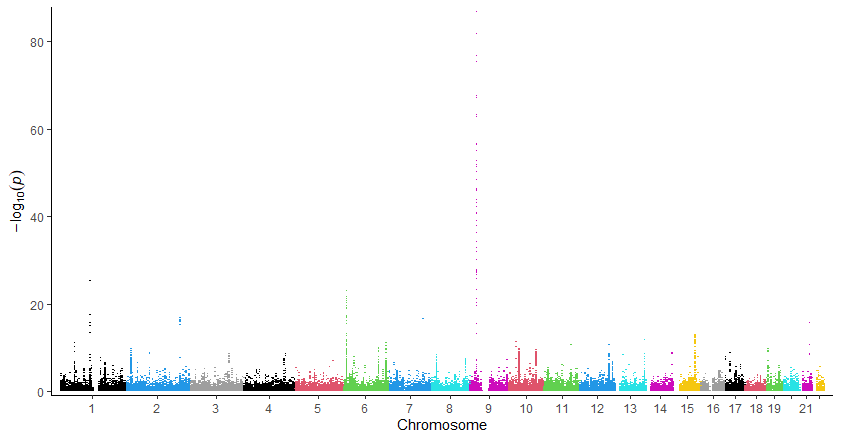
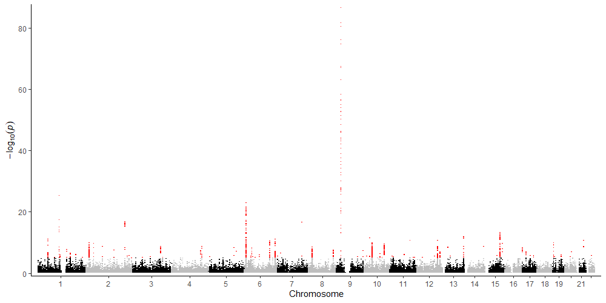
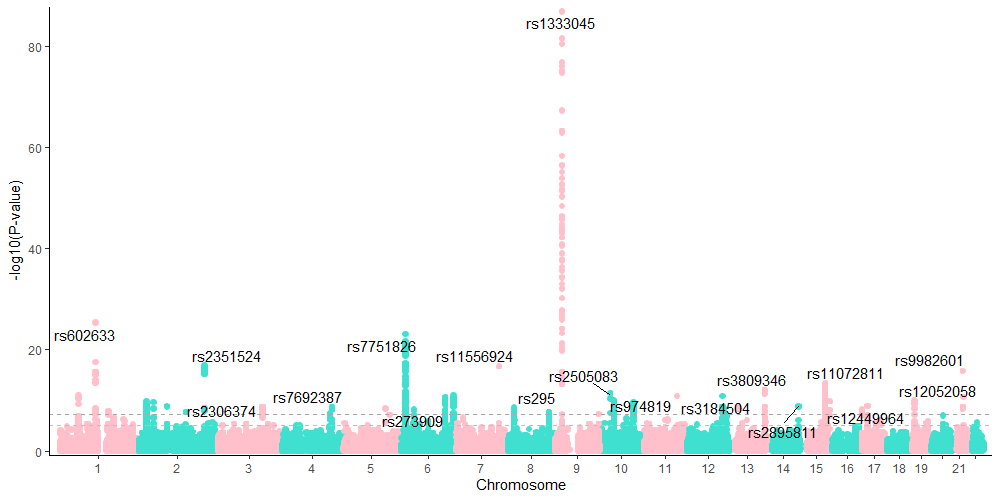
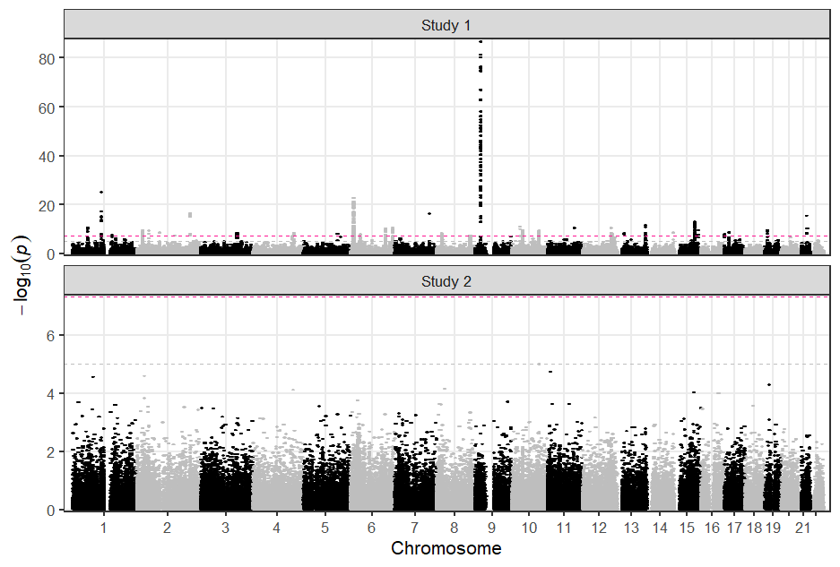
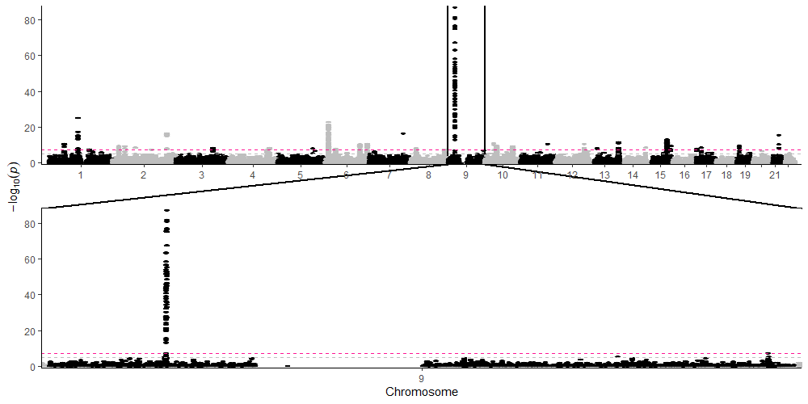
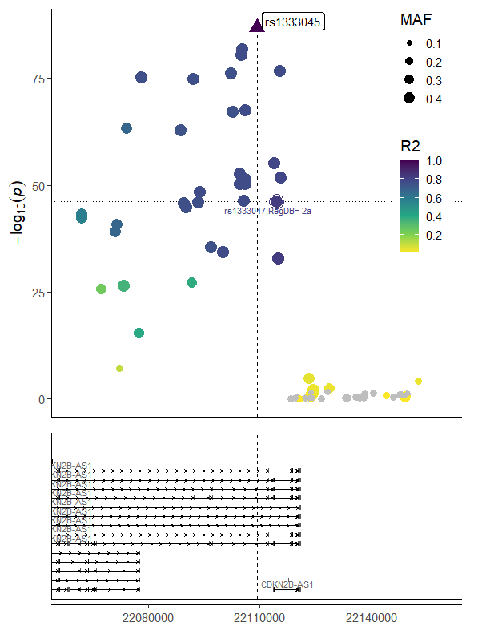
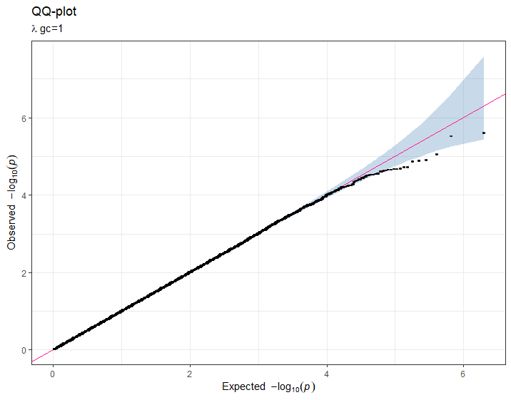
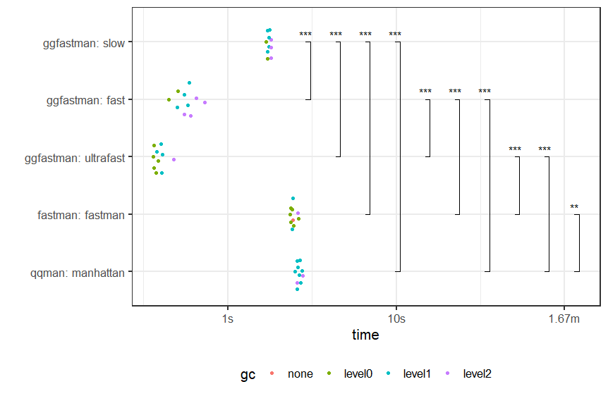
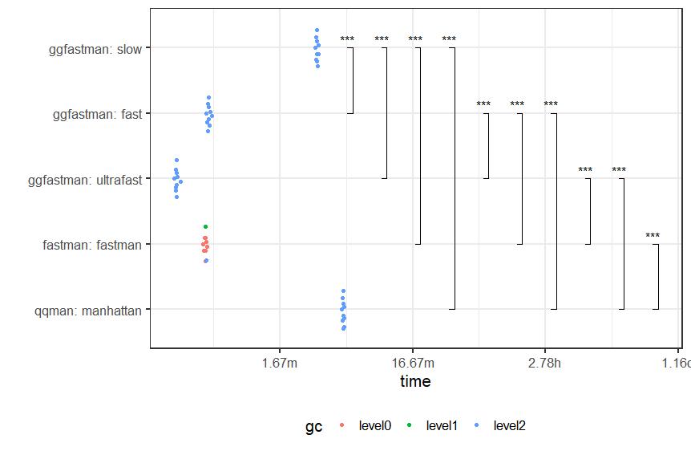

# ggfastman <a href="https://github.com/roman-tremmel/ggfastman"></a>
<br>
<br>
  
  
## Introduction

This is a fast and easily customizable plotting function for GWAS results (e.g., p-values). As it builds on `ggplot2`, the approach was inspired by a previous [project](https://github.com/boxiangliu/manhattan) and combined with the high-performance rendering strategy of the [scattermore ](https://github.com/exaexa/scattermore) R package.

A Manhattan plot displays chromosomal positions against - typically log10-transformed values - from genome-wide association study analyses (GWAS) between single nucleotide variants (SNVs) (historically also known as polymorphisms, i.e., SNPs) and an endpoint such as continuous traits like gene expression or enzyme activity, or binary traits such as case–control status.

One of the first and most known R packages providing both Manhattan and QQ plots was [`qqman`](https://github.com/stephenturner/qqman) by [Stephen Turner](https://twitter.com/strnr). Since then, many alternative tools and approaches have been developed in both R and Python. However, a solution that remains performant even when visualizing billions of data points has been lacking.

This package `ggfastman` aims to fill this gap.

## Installation

So far, the package has been tested on Windows and macOS, but it is not yet available on CRAN. Therefore, you need to install it via GitHub:

    devtools::install_github("roman-tremmel/ggfastman", upgrade = "never")
 
The package is depending on the additional packages `ggplot2` and `scattermore` and some more. If there are problems try to install at least the latter one using:

    devtools::install_github('exaexa/scattermore', dependencies = F, force = T, upgrade = "never")

## Citation

You can cite the package using

[](https://doi.org/10.5281/zenodo.10656742)
    
## Usage

### The normal speed option

As an example, you can load sample data included in the package and run the following code. More information about the dataset is available [here](https://github.com/boxiangliu/manhattan).

```{r}
library(ggfastman)
data("gwas_data")
head(gwas_data)
```

Importantly, the data must contain three required columns:

1. `chr`
2. `pos`
3. `pvalue`

The `chr` column should be formatted as `c("chr1", "chr2", "chr3", "chrX"...)`, the `pos` column must be a numeric vector representing base-pair positions, and the `pvalue` column should contain the p-values.

We can generate the Manhattan plot using the "slow" speed option, which relies solely on `ggplot2` functions, as follows.

```{r}
fast_manhattan(gwas_data, build='hg18', speed = "slow")
```

### The fast way

Depending on your system, this can take some time, particularly when plotting p-values for more than 1,000,000 SNVs. Therefore, `geom_point()` is replaced with `scattermore::geom_scattermore()` function by using the "fast" option in the Manhattan plotting function.

```{r}
fast_manhattan(gwas_data, build='hg18', speed = "fast")
#or
fast_manhattan(gwas_data, build='hg18', speed = "f")
```
Zooooom. that was fast, right?
The underlying speed improvement is largely inherited from the `scattermore` package. In brief, the performance is achieved through a combination of optimized C-level implementations, rasterization-based rendering, and efficient point aggregation techniques that reduce the overhead of plotting large numbers of individual data points and some magic. At least for me. 

Of course, you can increase the point size and the resolution, but this comes at the cost of reduced speed.

```{r}
fast_manhattan(gwas_data, build='hg18', speed = "fast", pointsize = 3, pixels = c(1000, 1000))
```

### The insane way

The fastest option is `speed = "ultrafast"`. This mode achieves maximum performance by plotting the data in pure black only. However, this trade-off is often worthwhile for extremely large datasets. Benchmark results are provided [below](https://github.com/roman-tremmel/ggfastman#benchmarks).

```{r}
# some big data file with >10^6 rows
big_gwas_data <-  do.call(rbind, replicate(15, gwas_data, simplify = FALSE)) 
fast_manhattan(big_gwas_data, build='hg18', speed = "ultrafast")

# compare with
fast_manhattan(big_gwas_data, build='hg18', speed = "fast")

# not compare with, unless you want to wait some minutes
fast_manhattan(big_gwas_data, build='hg18', speed = "slow")

```

## Individualization 

You can individualize the plot using standard ggplot2 functionality:

- xy-scales

```{r}
fast_manhattan(gwas_data, build='hg18', speed = "fast", y_scale = F) +
  ylim(2, 10)
# Of note, set `y_scale = F` to avoid the error of a second y-scale.
  
# distinct chromosomes  on x-axis
fast_manhattan(gwas_data[gwas_data$chr %in% c("chr1", "chr10", "chr22"),], build='hg18', speed = "fast")
  
```

- color

Add color globally or highlight only individual SNPs. Of note, this is working for `shape` in the "slow"-mode as well.

```{R}
gwas_data2 <- gwas_data
gwas_data2$color <- as.character(factor(gwas_data$chr, labels = 1:22))
fast_manhattan(gwas_data2, build = "hg18", speed = "fast")
```



Highlight only some SNPs

```{r}
gwas_data2$color <- NA
gwas_data2[gwas_data2$pvalue < 1e-5, ]$color <- "red"
fast_manhattan(gwas_data2, build = "hg18", speed = "fast")
```




- add significance line(s) and snp annotation(s)

```{r}
library(tidyverse)
library(ggrepel)
fast_manhattan(gwas_data, build='hg18', speed = "fast", color1 = "pink", color2 = "turquoise", pointsize = 3, pixels = c(1000, 500)) +
  geom_hline(yintercept = -log10(5e-08), linetype =2, color ="darkgrey") + # genomewide significance line
  geom_hline(yintercept = -log10(1e-5), linetype =2, color ="grey")  + # suggestive significance line
  ggrepel::geom_text_repel(data = . %>% group_by(chr) %>% # ggrepel to avoid overplotting
                             top_n(1, -pvalue) %>% # extract highest y values
                             slice(1) %>% # if there are ties, choose the first one
                             filter(pvalue <= 5e-08), # filter for significant ones 
                             aes(label=rsid), color =1) # add top rsid
```




- Facetting

```{r}
library(tidyverse)
gwas_data %>% 
  mutate( gr= "Study 1") %>% 
  # rbind a second study
  bind_rows(., mutate(., gr= "Study 2",
                      pvalue = runif(n()))) %>% 
  fast_manhattan(., build = "hg18", speed = "fast", pointsize = 2.1, pixels = c(1000,500)) + 
  geom_hline(yintercept = -log10(5e-08), linetype =2, color ="deeppink") + 
  geom_hline(yintercept = -log10(1e-5), linetype =2, color ="grey") + 
  facet_wrap(~gr, nrow = 2, scales = "free_y") +
  theme_bw(base_size = 16) + 
  theme(panel.grid.minor.y = element_blank(),
        panel.grid.minor.x = element_blank())
``` 




- Zoom using [`ggforce`](https://github.com/thomasp85/ggforce)

```{r} 
fast_manhattan(gwas_data, build = "hg18", speed = "fast",pointsize = 3.2, pixels = c(1000,500)) +
  geom_hline(yintercept = -log10(5e-08), linetype =2, color ="deeppink") + 
  geom_hline(yintercept = -log10(1e-5), linetype =2, color ="grey") + 
   ggforce::facet_zoom(x = chr == "chr9",zoom.size = 1)
```



- and locus plots with linkage data. Of note, you need to register at [LDlink](https://ldlink.nci.nih.gov/?tab=apiaccess) and obtain your own API token.
```{r} 
fast_locusplot(gwas_data, token = "replace with your token", show_MAF = T, show_regulom = T)
```



In addition, the package also provides a fast method for generating QQ plots.

```{r}
fast_qq(pvalue = runif(10^6), speed = "fast")
```



## Benchmarks

The benchmark analysis includes all operations involved in plot generation, including code evaluation, plotting, and saving a .png file using `png()` for base R plots and `ggsave()` for ggplot figures. For comparability, identical parameters were used across both approaches (e.g.,  `width = 270`, `height = 100`, `units = "mm"` as well as `res=300` and `dpi = 300`, respectively).

We compared the three speed options included in this package with `fastman::fastman()` and `qqman::manhattan` using `bench::mark()` with a minimum of 10 iterations. The complete code can be found here: [benchmark_plot](benchmark.R)

The first comparison was performed using example GWAS data comprising approximately 80k p-values (rows). As illustrated below, all three speed options were significantly faster than the two base R functions, although the "slow" option showed similar performance in terms of user experience.

```{r}
gwas_data$chrom <- as.numeric(gsub("chr", "", gwas_data$chr))
res_small_manhattan <- bench_plot(gwas_data)
plot_bench(res_small_manhattan)
```



In the next step, we generated Manhattan plots using very large datasets exceeding nine million data points by replicating the example data 120 times on a system equipped with an Intel Core i7-9700 CPU (3 GHz) and 32 GB RAM.

```{r}
big_gwas_data <-  do.call(rbind, replicate(120, gwas_data, simplify = FALSE)) 
nrow(big_gwas_data)
9495360
res_big_manhattan <- bench_plot(big_gwas_data)
```

There were again significant differences between the three analyzed methods. Notably,  [`fastman`](https://github.com/danielldhwang/fastman/blob/master/R/fastman.R) performed particularly well. Its speed largely stems from data cropping in non-significant p-value regions, for example retaining only a subset (e.g., ~20k points) for ranges such as p > 0.1, 0.01 < p < 0.1, and so on.

However, performance in the RStudio plotting window remains comparatively slow, even when using this "fast" approach. Nevertheless, for users working within base R, `fastman` appears to be a suitable choice for efficiently plotting datasets exceeding 9×10⁶ p-values.
 



# Questions and Bugs
Please report bugs by open github issue(s) [here](https://github.com/roman-tremmel/ggfastman/issues). 


